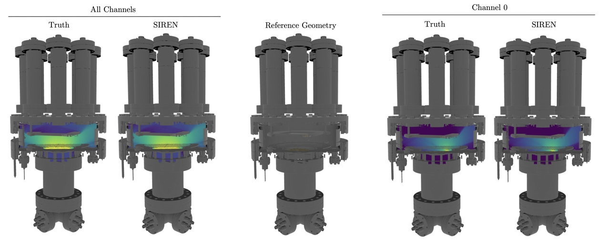
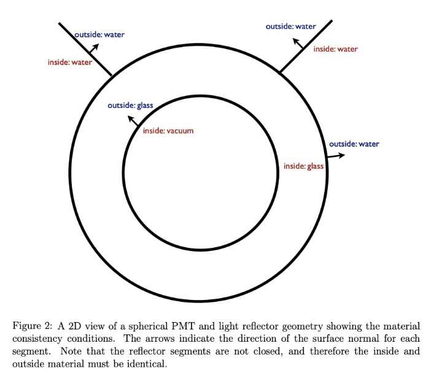
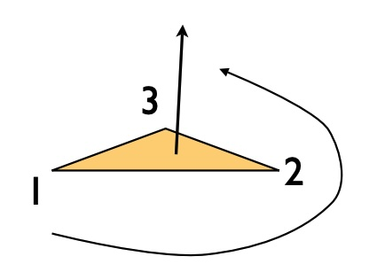
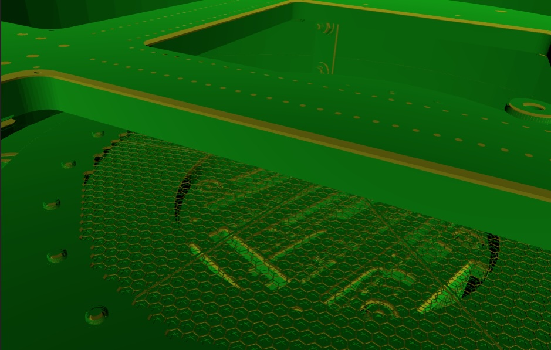
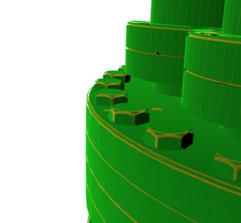

# Chroma-LAr

For scintillation spectra/timing, explicit TPB coatings, PMT TTS, and digitized
waveforms, see the [spectral optical simulation guide](docs/full_optical_simulation.md).
It includes a runnable synthetic example and the measured-calibration input format.
The accelerated full detector reached **25.65M input photons/s sustained** on
the local A100, including source generation, spectral transport, PMT response,
and CPU-readable waveforms with noise/ADC. See the
[full-pipeline results](benchmarks/optical_validation/FAST_FULL_REPORT.md) for
30M-photon repeats, boundary fixes, validation, and limitations. Calibration
values in the benchmark are synthetic. The earlier
[comparison](benchmarks/optical_validation/REPORT.md) records unresolved errors
in the separate meshed-wire paths.

The [maintainability refactor](benchmarks/optical_validation/maintainability/REPORT.md)
retains **25.50M photons/s sustained** and separates calibration compilation,
geometry queries, scheduling, and readout. See
[architecture and package feasibility](docs/optical_architecture.md) for extension
points and the work needed for a standalone Chroma-compatible distribution.

<p align="center">

</p>

Chroma-LAr provides a set of tools for modeling and analyzing the behavior of photons in liquid argon detectors using [chroma-lite](https://github.com/youngsm/chroma-lite) simulation framework. It includes:

- Scaffolding for defining custom geometries and materials for liquid argon detectors
- Tools to create, save, and use light maps in detectors
- Utilities for visualizing detector geometry and photon trajectories
- Integration with [SIREN](https://www.vincentsitzmann.com/siren/)-based neural networks to learn detector lightmaps

`chroma` allows for the simulation of complex geometries with arbitrary detector configurations, materials, and surfaces using the [chroma](https://github.com/benland100/chroma) simulation framework, a CUDA-based fast optical propagator with relevant physics processes. From the original repo,

>Chroma is a high performance optical photon simulation for particle physics detectors originally written by A. LaTorre and S. Seibert. It tracks individual photons passing through a triangle-mesh detector geometry, simulating standard physics processes like diffuse and specular reflections, refraction, Rayleigh scattering and absorption.
>
>With the assistance of a CUDA-enabled GPU, Chroma can propagate 2.5 million photons per second in a detector with 29,000 photomultiplier tubes. This is 200x faster than the same simulation with GEANT4.

`chroma` requires a CUDA-enabled GPU to work. To check if your GPU is CUDA-enabled, you can use the [CUDA GPU Checker](https://developer.nvidia.com/cuda-gpus). We will use [`chroma-lite`](https://github.com/youngsm/chroma-lite), which is a lighter version of `chroma` for just optical propagation -- with no Geant4 integration for particle propagation and scintillation generation.

### Installing chroma-lite

`chroma-lite` can be installed via pip, i.e.,

```bash
pip install -e git+https://github.com/youngsm/chroma-lite
```

</details>

### Setting up `chroma-lar` for use.

Install chroma-lar by following the instructions below.

```bash
# Clone the repository
git clone https://github.com/youngsm/chroma-lar.git
# Set up the environment
source chroma-lar/env.sh
# Add the environment setup to your bashrc (optional)
echo "source $PWD/chroma-lar/env.sh" >> ~/.bashrc
```

Note that `env.sh` adds the `chroma-lar` directory to your `PYTHONPATH`. This allows you to import the modules from the repository in your scripts.

### Specialized Triton backend

`Reflect3WiresTritonSimulation` implements the 450-nm
`detector_config_reflect_reflect3wires.py` production specialization. Its
default `tile_size=None` scheduler sizes each source wavefront from the CUDA
memory currently available. It therefore uses one wavefront whenever the
request fits, whether that is fewer or more than 15,000,000 photons, and
automatically tiles larger calls. This is important for throughput: fewer
source slabs mean less fixed scheduling work, while the cross-slab reservoir
drains rare long photon histories together.

#### Corrected production and Chroma-compatibility modes

There are deliberately two numerical policies:

- The default, corrected production policy uses the faster algebraic
  specular-reflection formula, instanced PMTs, analytic box intersections,
  the three wire planes proved reachable from this source, and Philox random
  numbers keyed by global photon ID. Its representable-progress guard rejects
  PMT intersections that cannot move any float32 position component. The
  throughput table below measures this policy.
- The compatibility diagnostic policy constructs the simulator with
  `legacy_specular_reflection=True` and
  `chroma_mesh_box_compatibility=True`, supplies an explicit
  `chroma_global_bvh_artifact=`, and uses a shared random tape. The artifact
  contains Chroma's complete cached global BVH and global triangle IDs,
  not the production PMT instances. Exact mode scans all six wire planes in
  Chroma's ascending order, uses the legacy reflection arithmetic, and turns
  the production progress guard off. The tape gives CUDA and Triton the same
  float32 random words in the same physical-interaction slots. This policy is
  for differential debugging; no production throughput claim is attached to
  it.

The two constructor flags alone do not enable exact mode or align random
streams. A bitwise check also needs the explicit global artifact, identical
normalized photon words, and the same `TorchRandomTape`. The artifact records
a mesh MD5, a traversal SHA-256, and an optical-semantics SHA-256 so a result
is tied to the geometry topology and optical assignments that were replayed.

The capacity model budgets 512 bytes per source photon. That conservative
figure includes live photon state, collision and survivor queues, a worst-case
full boundary queue, analytic and PMT query outputs, PMT candidate/BVH scratch,
source generation, and allocator slack. The planner uses at most 70% of the
allocatable memory and holds back another 512 MiB for JIT and library
allocations. It counts Torch's cached-but-unused blocks as allocatable, but
live tensors and allocations made by other processes reduce the next plan.
The resulting decision is available as `simulation.last_tile_plan` after a
call. `auto_memory_bytes=` can inject a reproducible budget for diagnostics;
normally it should be left as `None` so live CUDA memory is queried.

Boundary and PMT workspaces are allocated lazily from the queues actually
encountered, so a small call does not reserve the capacity of a large one.

Internally, collision and boundary kernels now append live photon IDs directly
to reusable device queues. This replaces the former full-wavefront status
arrays and follow-up compaction launches. Source slabs run a dense 128-round
prefix, after which their usually tiny surviving states are gathered into one
global-ID-preserving reservoir and drained together. Queue identity therefore
does not change the counter-based random stream, and large calls no longer pay
one long sparse tail per source slab. Analytic intersection, PMT traversal,
boundary-ray gathers, merge outputs, collision queues, and survivor buffers
all retain grow-on-demand storage across rounds and calls.

Corrected production PMT traversal rejects a triangle only when the exact
float32 update `position + distance * direction` would leave all three
coordinates unchanged.
This removes a discovered adjacent-triangle limit cycle (nanometre distances
at detector-scale coordinates) without imposing an arbitrary distance cutoff;
the traversal continues to the next representable intersection. Legitimate
long histories are still transported by the reservoir.

The default backend intentionally uses the algebraic specular-reflection law
rather than Chroma's `acos`/Rodrigues implementation. They are mathematically
equivalent, but Chroma's fast-math rounding occasionally places a ray just
inside a 0.075-mm wire and immediately absorbs it in steel at zero distance.
The algebraic form avoids that nonphysical self-entry, uses no transcendental
functions, and is faster. Setting `legacy_specular_reflection=True` removes
this correction for the compatibility experiment.

The representable-progress rule is deliberately disabled in compatibility
mode. That path can therefore reproduce Chroma's historical non-advancing
intersections; production keeps the guard because repeatedly selecting a hit
that cannot change stored float32 position is not useful physical transport.

For trajectory-level differential debugging, `simulate(..., random_tape=)`
accepts a CUDA `chroma.triton.rng_alignment.TorchRandomTape`. The collision
loop and exact-boundary loop then share rows keyed by global photon ID. Slots
0/1 are Chroma's absorption/scattering exponentials; an artificial empty-box
handoff consumes neither, so the boundary kernel reuses those exact words once
geometry distance is known. Rayleigh uses slots 2/3. A real surface uses slot
2 for its default-surface decision, followed conditionally by Chroma's
variable-length diffuse rejection draws or by the two dielectric draws.
Exactly one interaction cursor is committed per real bulk or boundary step.
Draw exhaustion, interaction exhaustion, row mismatch, and global-ID mismatch
are sticky failures and never fall back to Philox.

The returned `TritonSimulationResult.tape_audit` exposes the shared cursors and
flags. Its `tape_certificate` is a dense ledger with one raw word for every
committed interaction: the high four bits identify the process and the low 28
bits give its exact semantic draw count. Unused cells retain a sentinel, so
the validator can require a hole-free prefix through each interaction cursor
and compare every CUDA/Triton ledger word. `boundary_tape_trace` remains a
small last-interaction diagnostic. These allocations and stores are compiled
out of the production specialization.

This debug path covers the specialization's nonweighted, non-reemitting
450-nm bulk transport, default absorb/detect/specular/diffuse surfaces,
default-surface PASS, and dielectric reflection/refraction. Complex, WLS,
dichroic, angular, weighted, forced-scatter, and re-emission branches are not
represented by this specialization and still fail closed. Source generation
is outside the propagation tape: exact replay begins from the same normalized
photon words as CUDA.

#### Exact full-trajectory certificate

The two schema-v6 trajectory runs and their fail-closed composite below
supersede the earlier endpoint-only 1/16/64-step claims. They use source seed
`8123` and tape seed `99173` and are backed by pinned schema-v4 global-BVH
artifacts:

| Report | Replayed photons | Step limit | Result |
|---|---:|---:|---|
| [`detector_lockstep_global_64_steps_trajectory_certificate.json`](benchmarks/detector_lockstep_global_64_steps_trajectory_certificate.json) | 8,192 | 64 | every committed state exact; 89 still active |
| [`detector_lockstep_global_tail89_256_steps_trajectory_certificate.json`](benchmarks/detector_lockstep_global_tail89_256_steps_trajectory_certificate.json) | those 89 original IDs | 256 | every committed state exact; all terminal |
| [`detector_lockstep_global_full_trajectory_certificate.json`](benchmarks/detector_lockstep_global_full_trajectory_certificate.json) | 8,192 | through termination | complete composed trajectory exact |

For every committed physical interaction, both implementations store the same
15 raw `Photon` words: position, direction, and polarization (three words
each), followed by wavelength, time, history, last triangle, weight, and event
index (`evidx`). The validator compares their bit patterns, requires the state
ledger to have exactly the same hole-free occupancy as the process/draw ledger,
and rejects any non-sentinel suffix. Endpoint fields, active global-ID sets,
the exact-mode `last_instance == -1` invariant, audit cursors, and tape and
traversal overflow remain independently checked.

The fail-closed composite reopens and byte-checks the retained CUDA and Triton
arrays. It proves that the 89 selected photons are exactly the 64-step survivor
queue and that their independently regenerated normalized source words,
process/draw prefixes, and post-interaction state prefixes agree across all
5,696 overlapping interactions. It then substitutes those photons' longer
terminal replays. The resulting fixed-population proof contains 136,280 state
records, or 2,044,200 raw state words, and 509,853 random draws. All 8,192
photons terminate; the longest history contains 126 committed interactions.
The population exercises all eight supported physical outcomes: bulk
absorption/scattering, surface absorption/detection/diffuse/specular
reflection, and dielectric reflection/transmission.

The CUDA proof build also records and pins
`-DCHROMA_FORCE_SCATTER_AT_PASS=0`. This disables the optional forced-scatter
diagnostic at a surface PASS and makes the compiled reference semantics
explicit alongside the CUDA options, source hashes, runtimes, and A100 device.

Geometry is checked independently by the
[`full-detector ray certificate`](benchmarks/full_detector_geometry_certificate.json),
which is backed by a schema-v4 global-BVH artifact.
Its 16,396 rays cover both detector halves and targeted hits on all six wire
planes; every required global triangle, distance, oriented-normal, solid,
channel, material-side, surface-name, refractive-index, absorption-length, and
scattering-length word matches Chroma CUDA.

Reproduce the full-population trajectory prefix from this directory on a CUDA
host with the reference Chroma container installed:

```bash
PYTHONPATH=../chroma-lite:. python benchmarks/validate_detector_lockstep.py \
  --count 8192 --max-steps 64 \
  --source-seed 8123 --tape-seed 99173 \
  --tape-interactions 65 --draws-per-interaction 64 \
  --json benchmarks/detector_lockstep_global_64_steps_trajectory_certificate.json \
  --npz-prefix benchmarks/detector_lockstep_global_64_steps_trajectory_certificate
```

Select the exact survivor queue from that retained CUDA output and replay it
from step zero through termination:

```bash
PYTHONPATH=../chroma-lite:. python benchmarks/validate_detector_lockstep.py \
  --photon-id-from-npz \
    benchmarks/detector_lockstep_global_64_steps_trajectory_certificate.cuda.npz \
  --source-population 8192 --max-steps 256 \
  --source-seed 8123 --tape-seed 99173 \
  --tape-interactions 257 --draws-per-interaction 64 \
  --json benchmarks/detector_lockstep_global_tail89_256_steps_trajectory_certificate.json \
  --npz-prefix benchmarks/detector_lockstep_global_tail89_256_steps_trajectory_certificate
```

Finally, validate the prefix/tail splice and emit the compact full-population
certificate:

```bash
PYTHONPATH=../chroma-lite:. python \
  benchmarks/compose_detector_full_history_certificate.py \
  --prefix-report \
    benchmarks/detector_lockstep_global_64_steps_trajectory_certificate.json \
  --prefix-npz \
    benchmarks/detector_lockstep_global_64_steps_trajectory_certificate \
  --tail-report \
    benchmarks/detector_lockstep_global_tail89_256_steps_trajectory_certificate.json \
  --tail-npz \
    benchmarks/detector_lockstep_global_tail89_256_steps_trajectory_certificate \
  --output benchmarks/detector_lockstep_global_full_trajectory_certificate.json
```

`--source-population 8192` is essential: Chroma's NumPy source generator draws
population-sized coordinate blocks. Source generation itself remains outside
the random tape and is not an independently certified implementation. The
proof instead starts from and compares the initial position and CUDA-normalized
direction and polarization words used by both transports.

The validator generates its artifact directly from the same detector object
given to `GPUDetector`. To create a reusable artifact from the checked cached
configuration instead, run:

```bash
PYTHONPATH=../chroma-lite:. python -m \
  chroma_lar.triton_scene.chroma_global_bvh reference-global-bvh.npz
```

Artifacts are deliberately versioned and pickle-free. Schema-v3 files are not
accepted by the schema-v4 loader; regenerate them after geometry, optical
tables, the Chroma cache, or the artifact schema changes.

The focused Fresnel probe independently compares Chroma CUDA and Triton on
4,096 boundary states. Its pinned row zero is the formerly failing PMT
transmission from the detector run:

```bash
PYTHONPATH=../chroma-lite:. python benchmarks/probe_fresnel_compatibility.py \
  --count 4096 \
  --json benchmarks/fresnel_compatibility.json \
  --npz-prefix benchmarks/fresnel_compatibility
```

The incident angle, refracted argument/angle, normalized incidence axis,
output direction, output polarization, and all branch decisions are exact on
all 4,096 rows. The only reported nonexact diagnostic is an inert signed-zero
difference in the standalone reflection coefficient for 164 synthetic
equal-index cases (`-0.0` in CUDA versus `+0.0` in Triton); reflectance,
decisions, and output state remain bitwise identical.

Together these reports certify every post-interaction state and the terminal
outcome for this fixed 8,192-photon population under the strict detector
specialization. This is not a universal mathematical proof over every random
word, source, geometry, optical table, or unsupported Chroma branch. It also
does not certify the independent source generator or the corrected production
Philox/instancing/tiling/reservoir policy. Broader populations and feature
classes require new differential certificates and ensemble tests.

Set a positive integer `tile_size` to impose an exact manual photon cap and
bypass memory-based planning. The
acceptance harness follows the same policy with `--tile-size auto` (the
default), or accepts an explicit integer:

```bash
python benchmarks/validate_triton_backend.py \
    --backend triton --nphotons 15000000 --center -1000 0 0
```

On the A100 validation host, the resident three-replicate p95 rate is
20.081M photons/s at 15M photons, 26.078M/s at 120M, and 26.555M/s at 300M.
The corresponding measured Chroma rates are 1.010M/s, 1.163M/s, and
1.484M/s. See `benchmarks/throughput_scaling_optimized_loglog.png` and its
JSON/CSV companions for the requested log--log plot, per-run range, and Opticks
reference markers. The 2017 Opticks markers are compute-only results from its
[paper](https://doi.org/10.1088/1742-6596/898/4/042001) and use different
detectors and hardware. The exact 10.42-second 100M-photon JUNO point comes
from the author's [presentation table](https://simoncblyth.github.io/env/presentation/opticks_20241021_krakow_chep2024.html);
the related [2025 proceedings](https://doi.org/10.1051/epjconf/202533701093)
describe it only as approximately 10 seconds. These points provide context,
not a head-to-head speed comparison with this A100 run.

#### Experimental fused portal boundary

`fused_portal_boundary=True` is an opt-in experiment for the device scheduler
and requires both `device_scheduler=True` and `portal_boundary=True`. One
kernel classifies the five certified empty-box faces, executes corrected
production boundary physics for direct photons, appends their survivors, and
emits only the exact-geometry fallback IDs. It does not allocate a direct
queue or direct hit records. Random-tape replay, legacy reflection,
Chroma-global compatibility, branch-specialized boundary physics, and the old
PMT-grid experiment always remain on their established paths.

The implementation is exact but is intentionally not a default. A focused
1M-source A100 microbenchmark contained 990,696 real post-collision boundary
states, 67.52% of which were direct. Fusing improved that isolated operation
from 2.045G to 2.122G boundary photons/s (1.037x). In the warmed 5M full
simulation, however, it measured 11.634M photons/s versus 11.548M/s for the
materialized portal path (1.007x median with a worse p95); both were slower
than the 13.183M/s device scheduler with portals disabled. A separate
8,192-photon through-termination test matched every final-state and hit word.
The raw results are in
[`fused_portal_boundary_microbenchmark_1m.json`](benchmarks/fused_portal_boundary_microbenchmark_1m.json)
and
[`fused_portal_boundary_end_to_end_5m.json`](benchmarks/fused_portal_boundary_end_to_end_5m.json).
Both timed runs excluded compilation with untimed warmups. The experiment is
retained as a trustworthy reference for future fusion work, not promoted as a
throughput claim.

## Geometries

Chroma uses a geometry defined using double-sided triangles. A triangle's physical properties is fully defined by it's _inside_ material, _outside_ material, and a surface material. 

### Material considerations

The **inside (`material1`) and outside (`material2`) materials** identify the bulk properties of the two media the boundary separates.
* E.g., index of refraction and absorption lengths. See [`geometry/materials.py`](geometry/materials.py).

The **surface material** describes the optical properties of the surface
* E.g., diffuse and specular reflectivity, detection efficiency. See [`geometry/surfaces.py`](geometry/surfaces.py).

<p align="center">

</p>

Above is an example of the sort of materials you'd want to use for a spherical pmt + reflector submerged in water (a la SNO), taken from the Chroma whitepaper.

The orientation of a triangle is found by using the right hand rule on the triangle vertices in the order in which they are defined. This normal is defined as the direction of the inside material. 

<p align="center">

</p>

This is extremely important when defining the geometry of your detector, as the orientation of the triangles will determine the direction of the inside material. If you switch your inside and outside materials, Chroma might think that your detector volume is solid stainless steel and not liquid argon.

To check which material Chroma thinks is the inside and outside material, you can use the [`materials_checker.ipynb`](notebooks/materials_checker.ipynb) notebook or [`materials_checker.py`](macros/materials_checker.py) macro. This notebook will show you a visualization of the inside and outside materials based on the orientation of the triangles in a STL file by plotting two copies of the detector, one unchanged in yellow (the inner material) and one "exploded" view in green (the outer material). In most cases, the STL is correctly defined such that the inside material (yellow) is the the solid material (like SS) and the outside material (green) is the detector medium (like LAr). See example from the notebook below:

<p align="center">


</p>

From this STL we see that the inside material (yellow) is stainless steel and the outside material (green) would be liquid argon.


## Running Simulations and Analyses

> These notes are adapted from notes provided by Ben Land.

This repository uses a python-based simulation and analysis framework, [`pyrat`](pyrat), first developed by Ben Land at UPenn. The `pyrat` file is ran in conjunction with a _macro_, which is a python script that defines methods that pyrat will run at different stages of the simulation. Example usage:

```bash
pyrat macros/sample_sim.py --output test_output.root --evalset num_photons 1000
```

This command will run the `sample_sim.py` macro, outputting the results to `test_output.root`, and setting `db.num_photons`, the number of photons in each photon bomb, to 1000 instead of the default value used in `__configure__`.

### Macros

The macro is responsible for setting up the simulation, running the simulation, and analyzing the output. An example macro is found in `macros/sample_sim.py`.

* `__configure__(db)` is called once when the macro is loaded to add or modify fields in the database. This happens after any `--db` packages specified at runtime are loaded, but before any `--set` or `--evalset` options are evaluated. Returns nothing. Optional.

* `__define_geometry__(db)` is called once after `__configure__` and should return a Chroma geometry (pyrat will flatten and build the BVH) if a simulation is to be performed. If the result is None or this method does not exist, pyrat will not run a Chroma simulation, and will assume you are running an analysis over existing data. Optional.

* `__event_generator__(db)` should be a [python generator](https://wiki.python.org/moin/Generators) that yields something Chroma can simulate (`chroma.event.Event`, `chroma.event.Vertex`, or `chroma.event.Photons`) if running a simulation, or anything you want passed to `__process_event__` during an analysis.

* `__simulation_start__(db)` and `__simulation_end__(db)` are called before and after the event loop, which iterates over the event generator and calls `__process_event__` for each event.

* `__process_event__(db,ev)` receives the events from the event generator as they are generated. If a simulation is being performed, these will be Chroma `chroma.event.Event` objects post-simulation.

### Input/output

Macros are allowed to define any form of input/output they desire. It is suggested to use simple datastructures to store analysis results. Chroma defines a ROOT datastructure that stores all relevant Chroma event properties, and should be used for that purpose. Reading is done similarly. To save each event using this datastructure, add the `--output` flag to the pyrat command line arugments.

```bash
pyrat /path/to/macro.py --output /path/to/output.root
```

Similarly, if you already have a ROOT file with Chroma events that you want to re-analyze, you can use the `--input` flag.

```bash
pyrat /path/to/macro.py --input /path/to/input.root
```

### Databases (`db`)

The `database` module contains code to allow a python package (or module) to 
define a database that maps string keys to arbitrary values like a python 
dictionary. 

Each module in the package can define a property `__exports__` which should be
a list of variable names in the module to add to the database. 

Any module can define an `__opt_exports__` function which will be passed a 
dictionary of run-dependent options and can return a dictionary of keys and 
values to add to a database.

A database can be used like a standard python dictionary: `value = db[key]`.
It can also access string keys that are valid python variable names as fields
of the database object: `value = db.key`.

The `data` package contains default pyrat paramters and is self-documenting. 
For instance, see `data.chroma` for parameters that control the `Chroma` 
simulation. Macros can `__configure__` the database to add or modify fields, 
and load additional properties. The pyrat executable defines `--set` and 
`--evalset` options which set strings or python values (i.e., evaluated) to database keys. These are done in the order they are described, so runtime sets take precedence.
