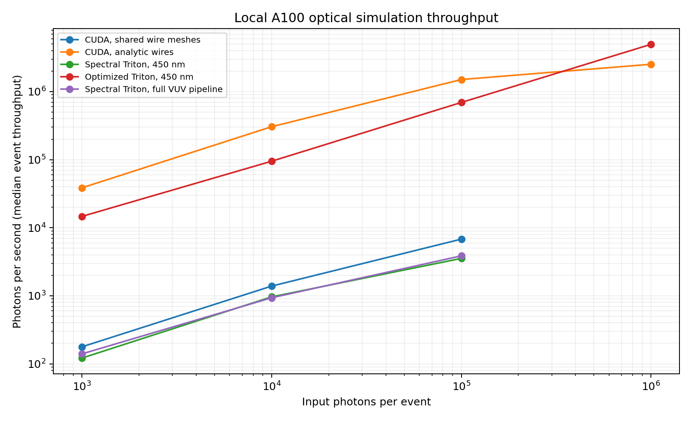

# Full optical validation and performance

For the subsequent corrected analytic/instanced full detector, see the
[25.65M photons/s full-pipeline report](FAST_FULL_REPORT.md). It includes
spectral physics, PMT response, and waveforms with noise/ADC. The mesh-path
timings and failures below are retained as historical comparison evidence.

All runs used the local NVIDIA A100-SXM4-40GB. No Modal jobs were used for this comparison.

**This is not a 100% correctness sign-off.** A separate lossless-wire diagnostic fails for both the original CUDA mesh path and the new spectral Triton path. Perfectly reflective wires spuriously absorb up to 0.565% of the input photons in the tested cases; analytic wires show zero such losses in those isolated probes. The later full-coordinate analytic-wire test is documented in the report linked above. Mesh boundary handling requires correction. The native-versus-mesh detector yield discrepancy also remains unresolved.

**116 regression tests passed**, 0 failures, 0 skipped. The independent analytic suite passed all 573 checks. CUDA memcheck reported zero errors.

The CUDA comparison covered 18 configurations, three seeds and 50,000 photons per seed: 2.7 million photons per backend. The shared full detector contains 2,205,488 triangles and 162 PMTs.

## Fixes found by the audit

- Replaced the seed/ID XOR hash, which aliased streams, with Philox4x32-10. Verified CPU integer output against [Random123 known-answer vectors](https://github.com/DEShawResearch/random123/blob/main/tests/kat_vectors) and GPU output across full-width seeds and IDs.
- Preserved piecewise-linear PDF slopes during sampling and integration. Coarse triangular PDFs now retain their shape. WLS time PDFs use the same exact inverse on CPU and GPU.
- Refreshed per-solid material and surface caches when applying calibration, so flattening uses the replacement optics.
- Rejected invalid zero-energy deposition metadata, fractional photon-ID bases, omitted input events, ambiguous WLS tables, and nonfinite transport results.

## Correctness comparisons

Absorption and competing collision rates, polarized Rayleigh scattering, Lambert reflection, Fresnel/Snell laws, WLS yield/spectrum/angles/delays, group velocity, scintillation spectra and time laws, Poisson yield, PMT TTS/collection/charge, pulse superposition and empty events were checked. Statistical thresholds were specified as six standard errors for fractions or DKW bounds with alpha=10^-6 per distribution check.

All 33,280 small-scene photons in the CPU/Triton comparison had matching history flags. The CPU reference uses brute-force triangle intersections. It shares some physics helpers; analytic tests and original CUDA provide additional independent comparisons.

For the full detector, both backends detected 3,882 of 150,000 input photons. Per-seed yield/history and detected-time/spectrum comparisons passed their thresholds; Triton had no unfinished photons. The matching aggregate count is a statistical observation, not proof of identical trajectories.

**Exact legacy equivalence does not hold.** The recorded CUDA baseline discrepancies are:

- Normal incidence, n1=1 and n2=1.5: original CUDA reflects 0%; Triton reflects approximately 4%, agreeing with the Fresnel law. The original angular ratio is 0/0 at exactly normal incidence.
- At the chosen critical-angle float32 input: original CUDA reflects about 99.75%, while the algebraic Triton/CPU calculation gives total internal reflection. This edge is sensitive to the original trigonometric/fast-math rounding.
- Original explicit specular reflection at normal incidence generates nonfinite directions; at oblique incidence it leaves polarization non-transverse (|direction dot polarization|=0.96 in the controlled case). Triton preserves finite transverse frames.

These discrepancies remain visible in the JSON results; thresholds were not relaxed to hide them. Original CUDA also lacks WLS surface delays and uses phase-index flight time. Those features were compared through separate analytic checks, not asserted to match the older model.

The additional wire diagnostic tests three wire orientations and three incidence angles, with 100,000 photons per case. Pure shadowing is close between polygonal and analytic cylinders (the faceted mesh has a smaller projected cross-section at grazing angles). With reflectivity set to one and no absorptive exterior medium, all photons should reach the enclosing sensor. Instead, the worst mesh case loses 565/100,000 photons through bulk absorption in both implementations, while analytic CUDA loses none. This isolates a numerical problem in mesh boundary handling; it does not establish that this is the sole cause of the larger full-detector yield difference. The 116-test regression suite and component distributions do not cover this failing invariant, so their passing results are insufficient for a detector correctness claim.

A follow-up trace of the worst wire case finds seven losses before reflection and 558 immediately after the first reflection. Selected rays were checked against float64 triangle intersections. For one missed entry, float64 finds the entry at 10.61722 mm, but float32 traversal selects the exit at about 10.62893 mm. For selected reflected rays, the computed position lies inside the wire, and the next intersection is an outward crossing only 0.000073–0.000513 mm away. This narrows the defect to intersection/position precision for the long, thin wire triangles. The reproducible trace and inputs are saved in `wire_boundary_detail.py`, `wire_boundary_detail.json` and `wire_boundary_input.pkl`.

## Full VUV event

A synthetic LAr deposition produced 99,526 photons, 282 optical hits and 251 photoelectrons in the full detector. All detections followed WLS re-emission. There were 0 unfinished photons; the empty event was preserved. Output waveform shape: [2, 162, 16000]. The test places the source at x=-1000 mm in LAr; x=0 lies in the steel cathode.

The test bundle explicitly makes glass VUV-opaque and photocathode detection visible-only; these are controlled software inputs, not measured calibration values.

## Performance

**Follow-up correction:** the old 1.96× end-to-end comparison has unequal source/output costs. The [matched input/output benchmark](prepared_transport/REPORT.md) measures a 1.30× median transport advantage at one million photons; at 100,000 photons CUDA is 2.73× faster. The original end-to-end measurements below are retained with their original contracts.

Each backend ran alone, with one discarded warm-up at each size and three measured repeats. Numbers below are medians for 100,000 photons. Setup and disk I/O are excluded; existing compiler caches are retained. Event time includes source generation and host-readable output. Transport stage includes GPU kernels and host scheduling, with synchronization at its boundaries.

| Configuration | Event time (s) | Photons/s | Transport (s) |
|---|---:|---:|---:|
| CUDA, shared wire meshes | 14.6989 | 6,803 | 14.6849 |
| CUDA, analytic wires | 0.0664 | 1,505,821 | 0.0533 |
| Spectral Triton, 450 nm | 28.2248 | 3,543 | 28.1839 |
| Optimized Triton, 450 nm | 0.1442 | 693,474 | included in event |
| Spectral Triton, full VUV pipeline | 25.8917 | 3,862 | 25.8041 |

At **1,000,000 photons**, CUDA, analytic wires takes **0.396 s** (**2.52 million photons/s**).

At **1,000,000 photons**, Optimized Triton, 450 nm takes **0.202 s** (**4.95 million photons/s**).

CUDA and spectral Triton share the same full mesh and source arrays in the mesh comparison. The native CUDA and optimized Triton paths use their existing detector acceleration strategies, so they are production-configuration comparisons. The optimized path supports only 450 nm and returns compact hits; spectral transport returns full photon states. The full VUV pipeline additionally generates spectra/emission delays and computes PMT response and two events of digitized waveforms. It performs different physics and returns more data.

**The native and mesh configurations are not validated as physically equivalent.** At the performance source (x=-1000 mm), original CUDA detects 3.636% with wire meshes versus 4.266% with analytic wires. The difference is 12.5 estimated standard errors. The spectral mesh result tracks the mesh baseline; the optimized result tracks the native baseline. This remains a detector-model discrepancy requiring resolution before claiming equivalent detector predictions.

See the JSON files for setup, warm-up, all repeats, batch sizes, upload/download and source costs, and electronics stage timings.

## Limits

The checks establish the specific agreements reported above; the failing wire invariant prevents a broad correctness sign-off. Bulk re-emission, charged-particle transport, microscopic TPB films, angle-dependent film optics, multi-photon WLS yields and joint wavelength/time distributions remain outside this path. Measured LAr/TPB/PMT inputs and matched detector observations are still required to validate physical predictions.

Raw evidence: `full_tests.xml`, `analytic_comparison.json`, `cuda_comparison.json`, `cuda_detector_comparison.json`, `memcheck.log`, `full_detector_pipeline.json`, and `performance_*.json`.
