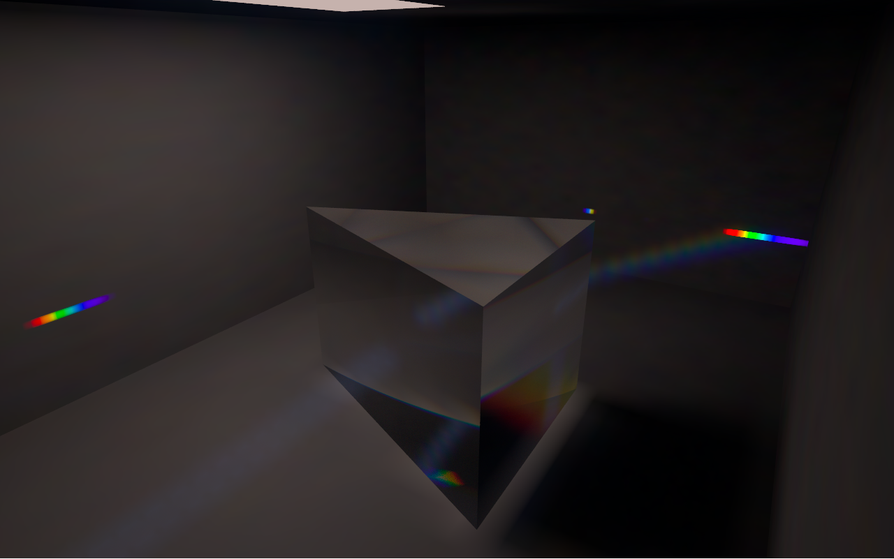
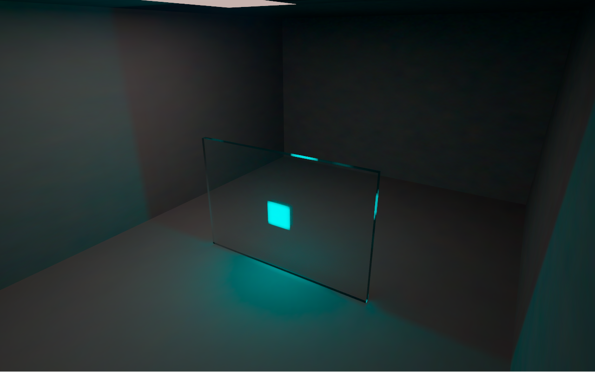
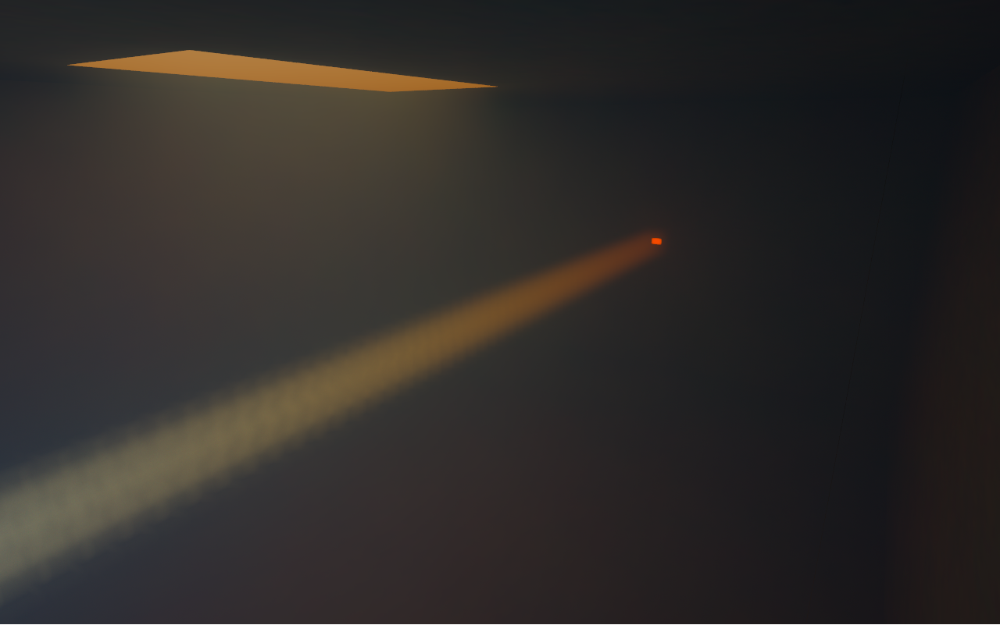
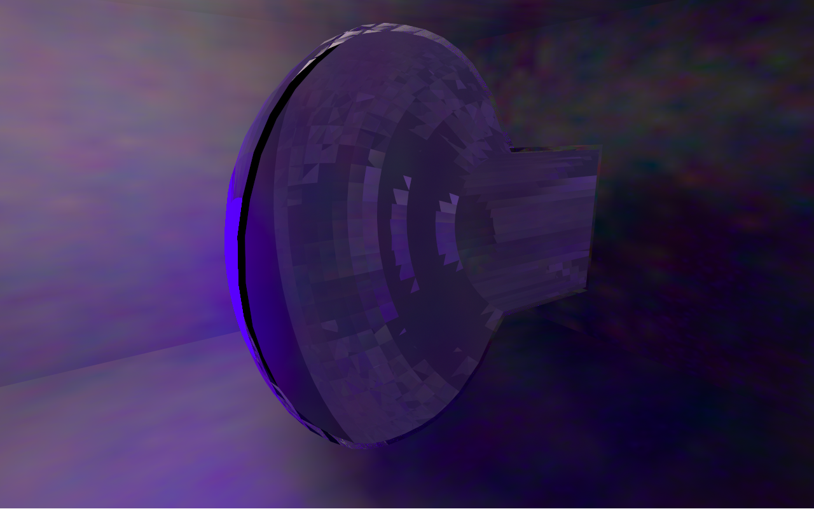

# Photon-camera validation

The camera notebook is `notebooks/photon_camera.ipynb`, using the registered
`trichroma-gpu` kernel. Its exported WebGPU bundle contains the prism,
fluorescent coating, Rayleigh medium, and TPB-coated PMT. Forward photons
populate spectral illumination maps; the camera gathers those maps through
the scene. Photon count controls statistical precision. Camera orbit reuses
the same simulated event.

## Rendered examples

The three studio images use 30 million source photons each, with 32 camera
samples at 1280 by 800 pixels. These are actual rendered camera outputs.

The PMT cutaway uses one unchanged 2.5M-photon event and 256 camera samples.
Its blue-violet light comes from visible TPB reemission; UV false color is off.
The cut affects camera visibility only. The finite triangle structure remains
visible in the glass and exact-area coating maps.

[PMT presentation provenance](pmt_presentation/README.md) records the camera
pose, exposure, event and exact served assets. No generated or enhanced image
is used.

[Native capture and source provenance](hardware_final/capture.json) retain
all photon counts, scene tables, shader hashes, and camera settings. These
captures were correctness and image-quality work; their queue times are not
sustained detector-transport benchmarks.

## Normalization and numerical checks

The actual camera's raw mean luminance changed by only 0.124%, 0.128%, and
0.087% for the prism, fluorescent coating, and Rayleigh medium when the
source count increased from 2.5M to 5M at identical camera settings. No
per-image normalization is applied. The measured ratios and their explicit
3% statistical acceptance bound are in the native capture report.

[CPU tests](cpu_tests.txt) pass 27 checks covering source weighting,
normalization, polarization phase, attenuation, emission flux, fixture
tables, trajectory provenance, and comparison failure detection.
[Source hashes](cpu_tests.json) identify the final tested Python files.
Three GPU-prefix tests belong to the separate native optical-showcase suite
and were deliberately excluded from this CPU run.

[Jupyter smoke](notebook/notebook_smoke.json) executes all three code cells
with the actual registered kernel, then runs the exported shaders inside
trusted notebook HTML at a prefixed local Jupyter origin. It verifies finite
camera output and no browser errors. The repository notebook remains clean
and unexecuted. This smoke uses 128 photons on CPU SwiftShader, independently
of the native million-photon captures.

[Fine-PMT software audit](fine_pmt_software/verification.json) compares
4,096 photons against independent CPU transport and deposition. All flags,
channels and stable IDs agree; position, time, wavelength and vector values
satisfy the unchanged declared tolerances. All map cells pass the strict
comparison, with no spatial-bin ambiguity. Both implementations record 282
photocathode detections. BVH and brute-force transport produce identical
terminal states; the corresponding camera images are identical before
display mapping. Cutaway and UV-display controls retain the original event
and maps and restore the original image exactly.

The same [4,096-photon audit on native NVIDIA Ampere](fine_pmt_hardware_final/verification.json)
passes all checks with maximum position disagreement 0.00490 mm and the same
282 photocathode detections. Its [cleanup sentinel](fine_pmt_hardware_final/cleanup.json)
and normal process exit confirm that the browser and local server closed.
An earlier completed audit followed by an unexplained process signal is
retained separately in `fine_pmt_hardware_audit/process_exit.json`.

The CPU collision observer now omits already completed photons from later
prefix replays. Every replay still starts from the original source state and
stable ID. [Five focused checks](observer_tests.json) prove exact old-versus-new
collision records and terminal arrays for all four scenes and exercise the
cell-edge audit. Completed CPU states, collision records, scene tables and
source hashes are cached before browser checks.

The fine PMT is a new polygonal approximation of the same R5912 profile,
using 20 rings and 48 azimuth segments. It has 3,840 PMT facets and 624
exact-area TPB charts. Its forward photons and camera share the same mesh.
The original detector geometry and the earlier coarse demonstration remain
separate. The synthetic optical calibration is explicitly identified in each
exported manifest.

## Retained differences and limits

[Original strict map audit](coarse_pmt_strict_map_audit/verification.json)
retains the complete four-scene 4,096-photon comparison, including its failed
prism map assertion. Prism photon 738 has CPU wall position
`x = -84.3748321533 mm`, just above the cell edge at `-84.375 mm`. Its GPU
position falls in the adjacent cell; packet energy and terminal fate agree.
The strict map result is deliberately retained as a failure.

The additional wall-deposition oracle reports every adjacent-cell crossing,
checks its physical position error against the existing 0.02 mm transport
tolerance, and independently bins the recorded GPU wall position. CPU packet
energies, wavelengths and all interior collision records remain unchanged.
This separates a discontinuous density-map bin decision from optical-event
agreement; it does not establish exact CPU/GPU map equality.

The [required tenfold expansion](prism_expanded/verification.json) compares
40,960 photons and passes its declared checks with normal process exit. Flags,
channels, stable IDs and wavelengths agree exactly. Maximum numeric position
and time differences are 0.01220 mm and 0.0000621 ns. Two packets, IDs 738 and
39164, straddle adjacent wall-cell edges; the strict map comparison remains
false for their four affected cells. The independent deposition check accounts
for all cell differences and preserves summed energy, retaining CPU energies
and interior records. Every other map cell satisfies the unchanged absolute
and relative accumulation tolerances.

A [native 40,960-photon completion check](prism_expanded/native_completion/capture.json)
terminates all photons within 52 steps and agrees with independently calculated
weighted source energy to 5.6e-8 relative. The cached CPU oracle is retained in
`prism_expanded/cpu_oracles/`. An intermediate debug-decoder omission is recorded
in `initial_harness_failure.json`; it produced no optical comparison verdict.

The earlier rare rounded bulk collision at a room wall is documented in
[the retained boundary diagnosis](boundary_rounding/README.md). The final
policy preserves the selected scattering interaction and moves its origin
representably inside the medium. A subsequent native test completed 300M
Rayleigh photons across ten seeds with no escape or unfinished photons.
Near-tie FP32/FP64 event ordering differences remain explicitly disclosed.

The image estimator has finite spatial and spectral resolution, first-order
diffuse wall reflection, and a bounded camera path depth. A PMT cutaway is a
camera-visibility diagnostic of unchanged forward photon maps; its optional
UV coloring is explicitly false color. These checks support the documented
scenes and tolerances, not universal or bitwise equivalence to all Chroma
geometries.
