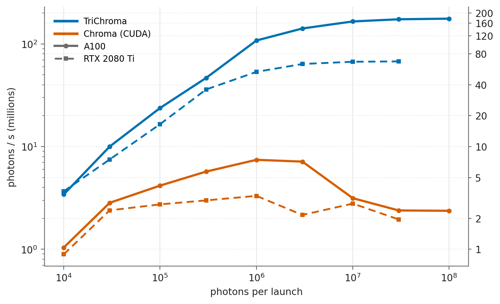
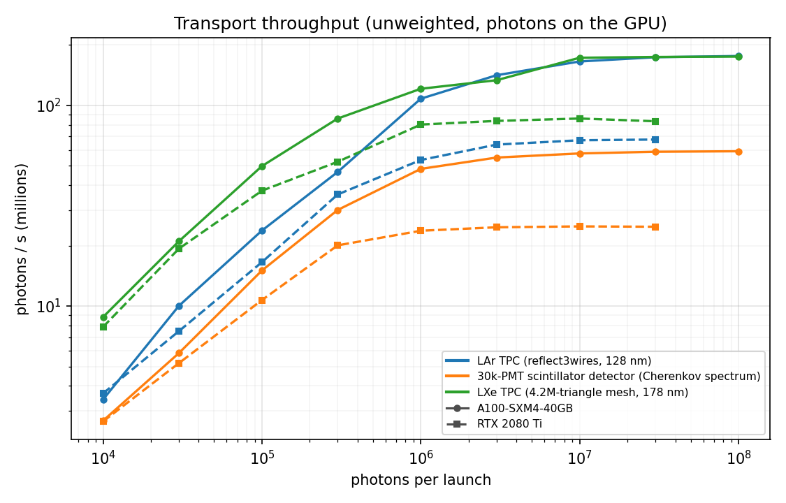

# Performance

## Against CUDA Chroma



Transport alone on chroma-lar's reflect3wires LArTPC (128 nm point source at
the LUT voxel, unweighted, photons already on the GPU). CUDA Chroma runs in
its packed mode, the one chroma-lar's LUT script uses. TriChroma is 15x
faster at 10^6 photons per launch and 74x at 10^8 on the A100 (16x and 35x on
the RTX 2080 Ti). CUDA Chroma is fastest near 10^6 photons per launch.

Whole workloads on an A100 (40 GB), against CUDA Chroma on the same GPU:

| Workload | CUDA Chroma | TriChroma |
|---|---|---|
| 30M prepared photons, one weighted `simulate()` call (LUT style) | 0.55M photons/s | 21M photons/s (41M with opt-in roulette) |
| waveform-map macro, photons drawn on the GPU | 0.29 s per voxel (numpy photons) | 3.1 ms per voxel |
| pixel-detector quantile LUT, 30M photons per voxel, GPU photons | ~42 s per voxel (numpy photons) | 0.22 s per voxel |

- **CUDA Chroma's rates** include its wire defects, which end many histories
  early and lose 15% of the light on these detectors (see
  [design](design.md)).
- **Photons from numpy.** Scripts that generate photons with numpy on the CPU
  gain only 2-5x until the photons are drawn on the GPU (`trichroma.sources`).
- **Macro rows.** The macro numbers use the chroma-lar branch
  [`trichroma-fast-waveform`](https://github.com/youngsm/chroma-lar/tree/trichroma-fast-waveform)
  and were measured before the September 2026 engine revision.

## Drawing photons on the GPU

Photons drawn on the GPU never visit host memory:

```python
from chroma.event import Event
from trichroma import sources

photons = sources.photon_bombs(200_000, voxel_centres, voxel_size=30, wavelength=450)
events = (Event(photons_beg=photons[i * 200_000:(i + 1) * 200_000]) for i in range(len(voxel_centres)))
for event in sim.simulate(events, keep_flat_hits=True, photons_per_batch=5_000_000):
    ...
```

## Throughput versus photons per launch



The transport engine alone, for three kinds of detector:

- **LArTPC (VUV):**
  - geometry: chroma-lar's reflect3wires (162 PMTs, analytic TPC boxes,
    three wire planes);
  - source: a point source at the LUT voxel (-450, 60, -120) mm, 128 nm;
  - ~17 steps per photon.
- **Theia-like (Cherenkov):**
  - geometry: 30,210 instanced 20-inch PMT meshes (18M triangles) around a
    liquid-scintillator volume;
  - source: a point source at the centre with a Cherenkov spectrum, whose UV
    part the scintillator absorbs and re-emits;
  - ~6 steps per photon.
- **LXeTPC (VUV):**
  - geometry: a 4.2M-triangle CAD mesh (chroma-lxe);
  - source: 178 nm;
  - ~1.6 steps per photon.

Each point is an isotropic point source drawn on the GPU and run to
completion by `engine.propagate`: unweighted, `max_steps=1000`, default
settings. The time is the best of several launches after a warm-up launch.
Photons per second:

| Detector | A100, 10^6 photons | A100, 10^8 | RTX 2080 Ti, 10^6 | RTX 2080 Ti, 3·10^7 |
|---|---|---|---|---|
| LArTPC (VUV) | 108M | 176M | 53M | 68M |
| Theia-like (Cherenkov) | 48M | 59M | 24M | 25M |
| LXeTPC (VUV) | 121M | 175M | 80M | 83M |

**Small launches cannot fill the GPU.**
- Each warp keeps up to 128 photons in flight, so an A100 holds about 280k
  photons at once.
- Below a few million photons, the last photons of a launch dominate its
  time.
- `simulate()` groups small events into launches of `photons_per_batch`
  photons. The default of 10^6 is safe on any GPU; on a large one, ~10^7 is
  close to full speed.
- The RTX 2080 Ti's 11 GB holds up to ~3·10^7 photons per launch.

**Reproducing the figure.** `benchmarks/throughput_scaling.py` and
`benchmarks/plot_scaling.py` reproduce it for any detector. The measured
points are in `img/scaling_data/`.
